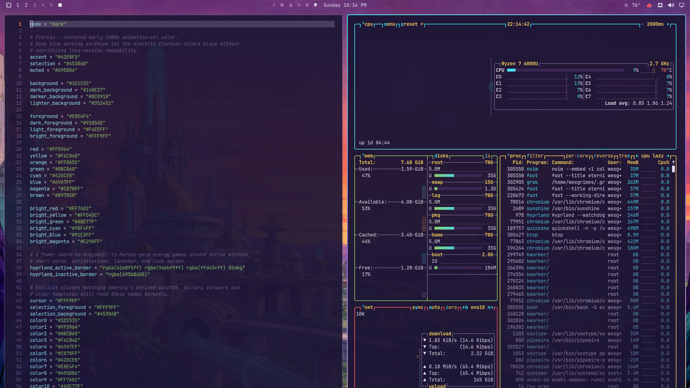
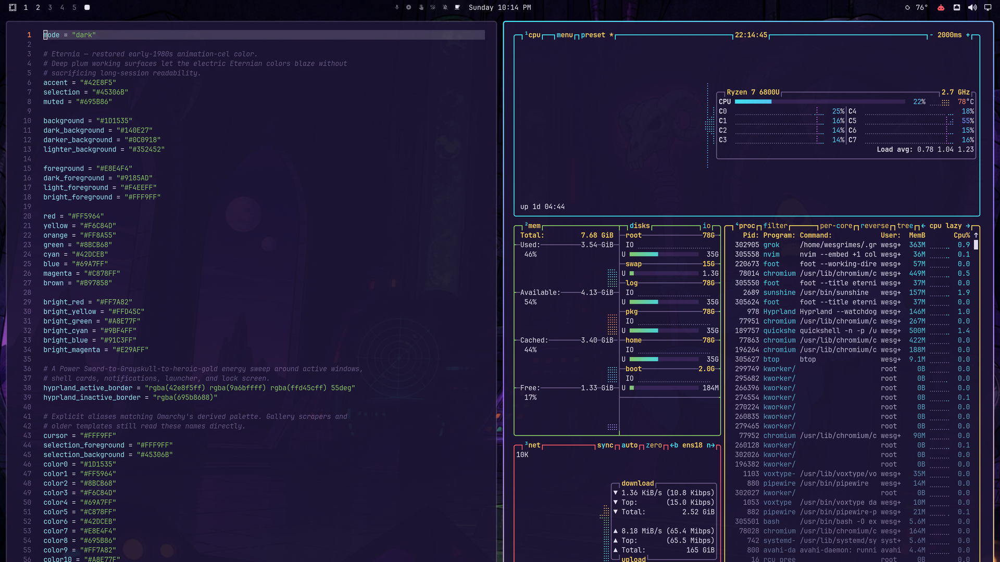
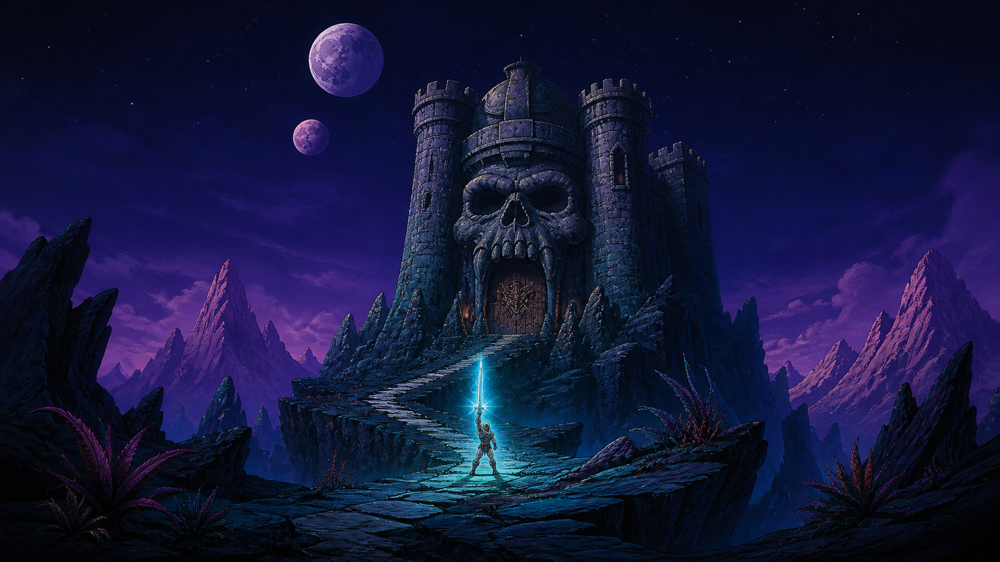
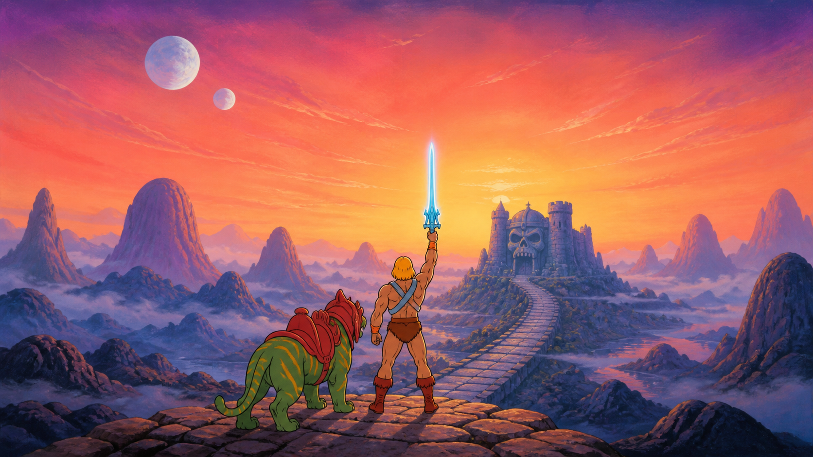
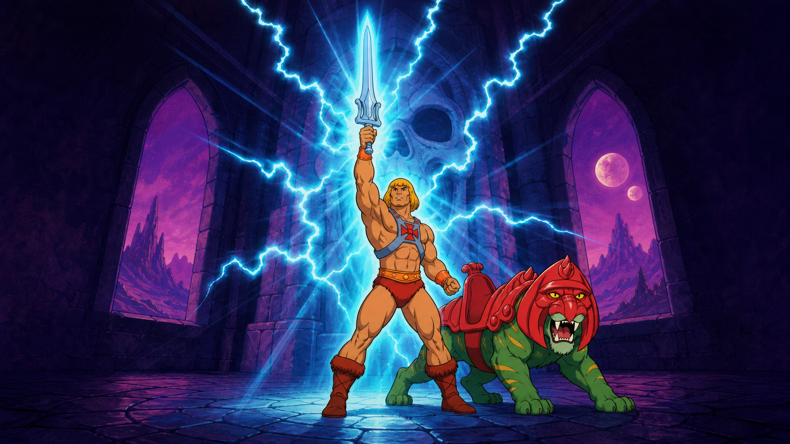
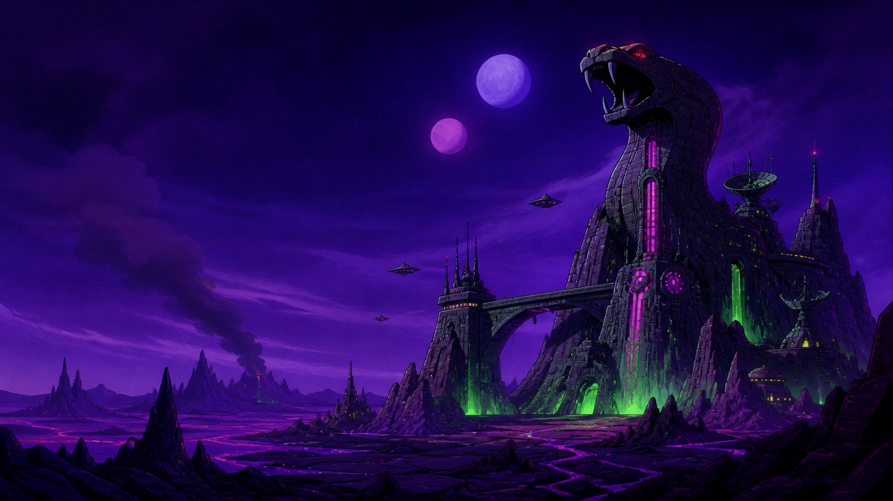
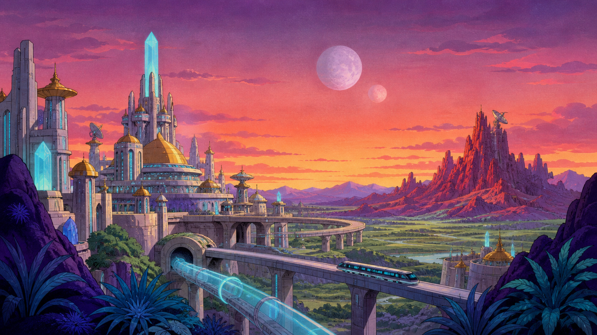
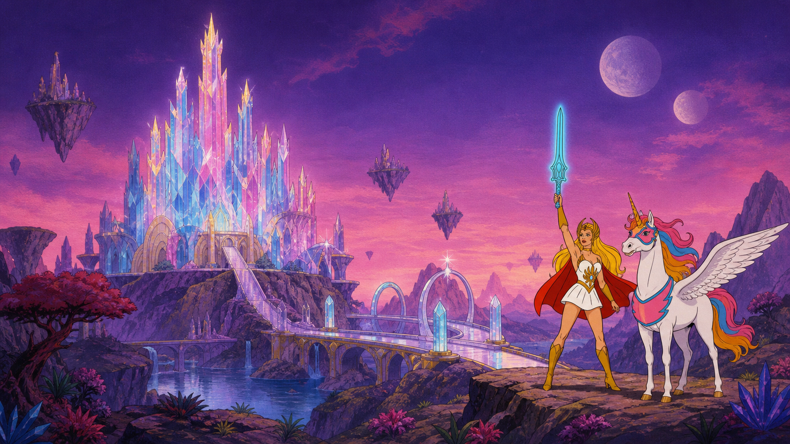
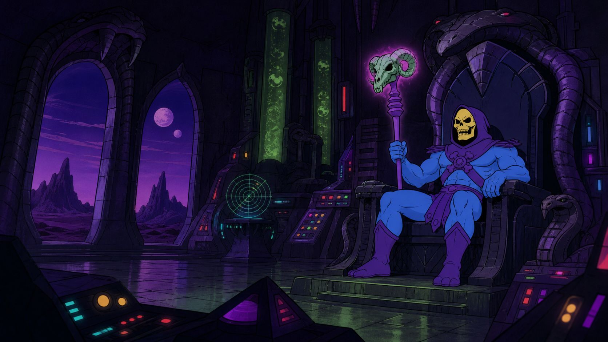

# Eternia for Omarchy

A saturated, retro-futuristic Omarchy theme inspired by the heroic science
fantasy and restored animation-cel color of early-1980s Eternia.

Deep Grayskull violet forms the working surfaces. Power Sword cyan, royal
violet, hot coral, Battle Cat green, and heroic gold carry focus, syntax,
status, and active-window states. The active border sweeps from cyan through
violet to gold.

## Preview





## Background gallery

Click any image to open the full-resolution wallpaper.

| Castle Grayskull | For Eternia | By the Power | Snake Mountain |
|:---:|:---:|:---:|:---:|
| [](backgrounds/1-castle-grayskull.png) | [](backgrounds/2-for-eternia.png) | [](backgrounds/3-by-the-power.png) | [](backgrounds/4-snake-mountain.png) |
| **Eternos & Point Dread** | **Crystal Castle** | **Skeletor's Throne** |  |
| [](backgrounds/5-eternos-point-dread.png) | [](backgrounds/6-crystal-castle.png) | [](backgrounds/7-skeletor-throne.png) |  |

## Install

```bash
omarchy theme install https://github.com/wesleygrimes/omarchy-eternia-theme.git
```

Omarchy derives the theme name `eternia` from the repository name and applies
it after installation.

## Use

Apply the theme again at any time:

```bash
omarchy theme set Eternia
```

Cycle through the seven included backgrounds:

```bash
omarchy theme bg next
```

## Included

- A complete semantic and ANSI palette in `colors.toml`
- A cyan-violet-gold Hyprland and Omarchy shell border gradient
- Seven widescreen backgrounds spanning Castle Grayskull, Eternos, Point Dread,
  Snake Mountain, She-Ra's Crystal Castle on Etheria, and Skeletor's throne room
- A theme-switcher preview
- A widely available Yaru Magenta icon-theme preference

Omarchy generates safe, version-compatible configurations for terminals,
Neovim, btop, Chromium, Helix, Obsidian, the Omarchy shell, Hyprland, and other
supported applications from `colors.toml`. This repository intentionally does
not ship executable Lua, terminal command configuration, personal Hyprland
settings, or editor-extension installers.

## Compatibility

Designed for current Omarchy releases using the semantic `colors.toml` theme
format. No absolute paths or machine-specific settings are included. Omarchy's
normal fallbacks apply if Yaru Magenta icons are unavailable.

Window opacity, blur, gaps, and corner radius are deliberately left to each
user's existing Hyprland configuration.

## Artwork and attribution

The included backgrounds are AI-generated original fan artwork created for
this theme. They contain no copied logos or text.

This is an unofficial, non-commercial fan project. *He-Man and the Masters of
the Universe*, Eternia, Castle Grayskull, Snake Mountain, and related names and
characters are trademarks and intellectual property of their respective
owners. This project is not affiliated with or endorsed by Mattel.

The theme configuration may be reused and adapted with attribution. No license
or ownership claim is made over third-party names, characters, or settings.
